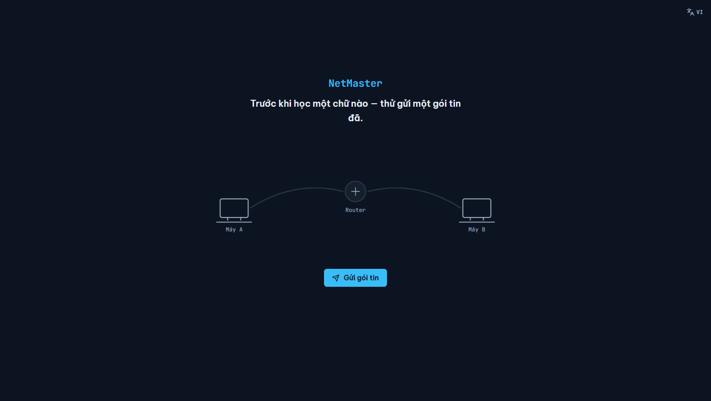
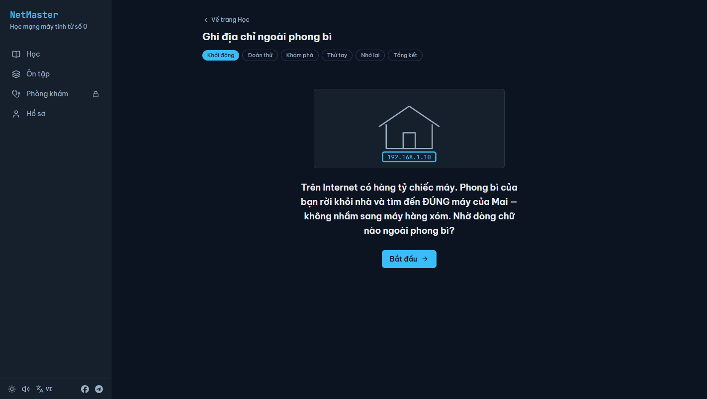
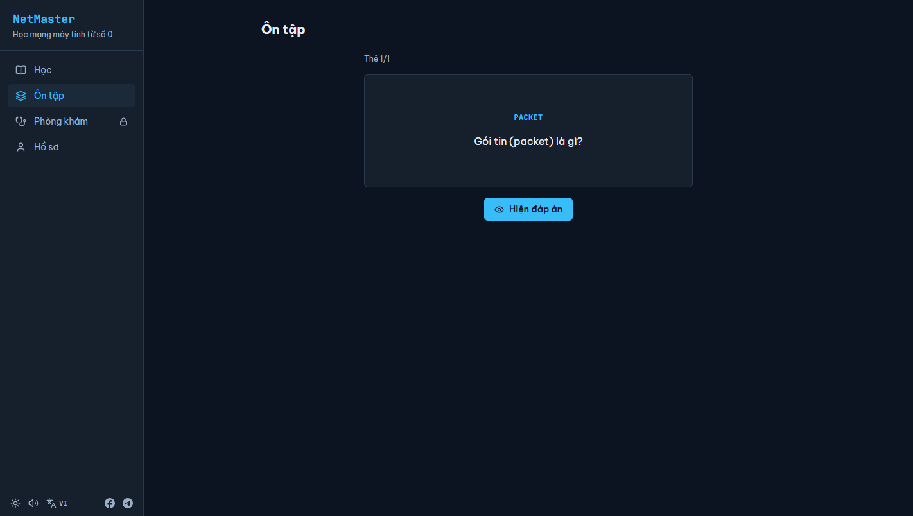
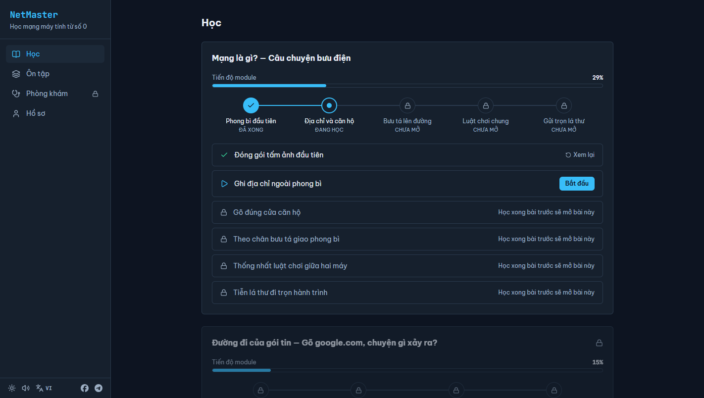

# NetMaster — học mạng máy tính từ số 0

App tự học mạng máy tính bằng tiếng Việt, dạy từ "mạng là gì" đến trình
độ đi làm (IT Support / SysAdmin). Điểm khác biệt: app được thiết kế từ
khoa học học tập trước, nội dung sau — mọi bài học đều ép người học
**lôi kiến thức ra khỏi đầu** thay vì đọc lướt cho xong.



Trong 60 giây đầu tiên, trước cả màn giới thiệu, bạn bắn một gói tin từ
Máy A qua router sang Máy B và nhìn nó chạy. Cả khóa học là câu chuyện
đằng sau chuyến đi đó, kể bằng ẩn dụ bưu điện: thư là dữ liệu, phong bì
là gói tin, địa chỉ nhà là IP, bưu tá là router.

## Cơ sở khoa học

Mỗi bài học đi qua đúng 6 bước, không bài nào bỏ được bước nào:

| Bước | Kỹ thuật |
|---|---|
| 1. Khởi động | Curiosity gap — một câu hỏi lạ chưa có lời đáp |
| 2. Đoán thử | Pretesting — đoán sai trước khi học giúp nhớ tốt hơn |
| 3. Khám phá | Dual coding — mỗi màn hình đúng một khái niệm, hình đặt cạnh chữ |
| 4. Thử tay | Productive failure — tự thử-sai trước, gợi ý sau 2 lần sai, lời giải sau 3 lần |
| 5. Nhớ lại | Active recall — đóng hết nội dung, trả lời từ trí nhớ và tự giải thích bằng lời mình |
| 6. Tổng kết | Peak-end — ba ý đọng lại và một câu úp mở bài sau |

Quanh pipeline đó là ba hệ thống:

- **Ôn ngắt quãng (SM-2 đơn giản hóa).** Mỗi khái niệm học xong tự sinh
  flashcard, hẹn ôn 1 → 3 → 7 → 14 → 30 ngày, quên thì quay về 1 ngày.
  Mở app khi có thẻ đến hạn là ôn trước, học sau.
- **Mastery gate.** Đạt từ 85% bài kiểm tra module mới mở module sau.
  Không có nút bỏ qua. Thi lại thoải mái, thi không cộng điểm thưởng.
- **Phần thưởng gắn học sâu.** XP và chuỗi ngày chỉ cộng khi làm bài và
  nhớ lại, không cộng cho việc đọc. Lỡ một ngày có 2 lượt "đóng băng"
  mỗi tháng, không tạo áp lực độc hại.

| Bài học 6 bước | Phiên ôn flashcard |
|---|---|
|  |  |



## Chạy local

Cần Node 22 trở lên.

```bash
npm install
npm run dev        # dev server tại cổng 5173
npm test           # toàn bộ test (Vitest)
npm run typecheck  # kiểm tra kiểu TypeScript
npm run build      # build production vào dist/
```

## Deploy

Push lên nhánh `main` là xong: workflow `deploy-pages` chạy test +
typecheck, đỏ thì dừng, xanh thì build và đưa lên GitHub Pages. Lần đầu
cần bật trong repo: Settings → Pages → Source → GitHub Actions. Base
path lấy tự động theo tên repo nên đổi tên repo không phải sửa gì.

## Lộ trình 12 module

Phần A — nền móng (đã có trong bản này):

1. Mạng là gì? — Câu chuyện bưu điện
2. Đường đi của gói tin — gõ google.com, chuyện gì xảy ra?
3. Địa chỉ — MAC, IP và Subnetting (kèm chế độ luyện chia subnet mỗi ngày)

Phần B — hạ tầng (đang làm):

4. Switch, Router, VLAN — lab kéo-thả lắp mạng
5. TCP, UDP và Port — cung điện ký ức 15 phòng
6. DNS và DHCP
7. NAT, Firewall và mạng gia đình

Phần C — đi làm:

8. Wi-Fi và IPv6 chuyên sâu
9. Windows Server — AD DS và GPO
10. Cloud Networking và Zero Trust
11. Troubleshooting — phòng khám mạng
12. Tự động hóa — PowerShell cho người quản trị mạng

## Giấy phép

MIT — xem [LICENSE](LICENSE).

Dựng bằng React, Vite, TailwindCSS, Zustand và motion; icon Lucide;
font Be Vietnam Pro và JetBrains Mono.

Liên hệ: [Facebook](https://www.facebook.com/thien.phuc.450676/) ·
[Telegram](https://t.me/Benedetta24k)
